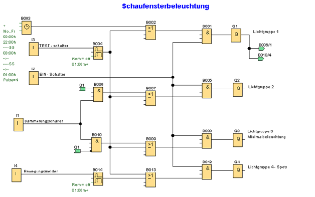

In einer Brauerei wird die Heizung des Brennkessels über einen Schütz Q1 eingeschalten werden, wenn der Brennkessel gefüllt ist (I5) und einer der beiden Temperatursensoren I1 oder I2 
eine zu niedrige Temperatur meldet. Wenn einer der beiden Drucksensoren I3 oder I4 einen zu hohen Kesseldruck meldet, darf nicht eingeschalten werden. Bei einem zu hohen Druck leuchtet die Warnleuchte Q2. 

Verwendete Komponenten:

+ I1, I2 niedrige Temperatur = 1
+ I3, I4 niedriger Druck = 1
+ I5 gefüllt = 1
+ Q1 Heizungsschütz
+ Q2 Warnleuchte

  
