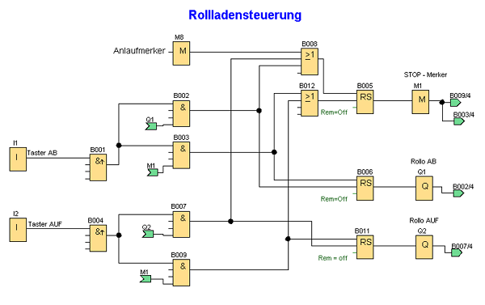

Es soll eine Rollladensteuerung mit AUF und AB-Tasten erstellt werden. Aus Sicherheitsgründen verwenden wir einen Anlaufmerker. 
Der Anlaufmerker „M8“ ist im ersten Zyklus des Anwenderprogrammes gesetzt und wird automatisch nach Durchlauf des ersten Zyklus zurückgesetzt. 
In allen weitern Zyklen bleibt seine Funktion als Merker analog zu den a nderen. Damit können unkontrollierte Zustände z.B. nach einem Netzspannungsausfall vermieden werden. 

  
