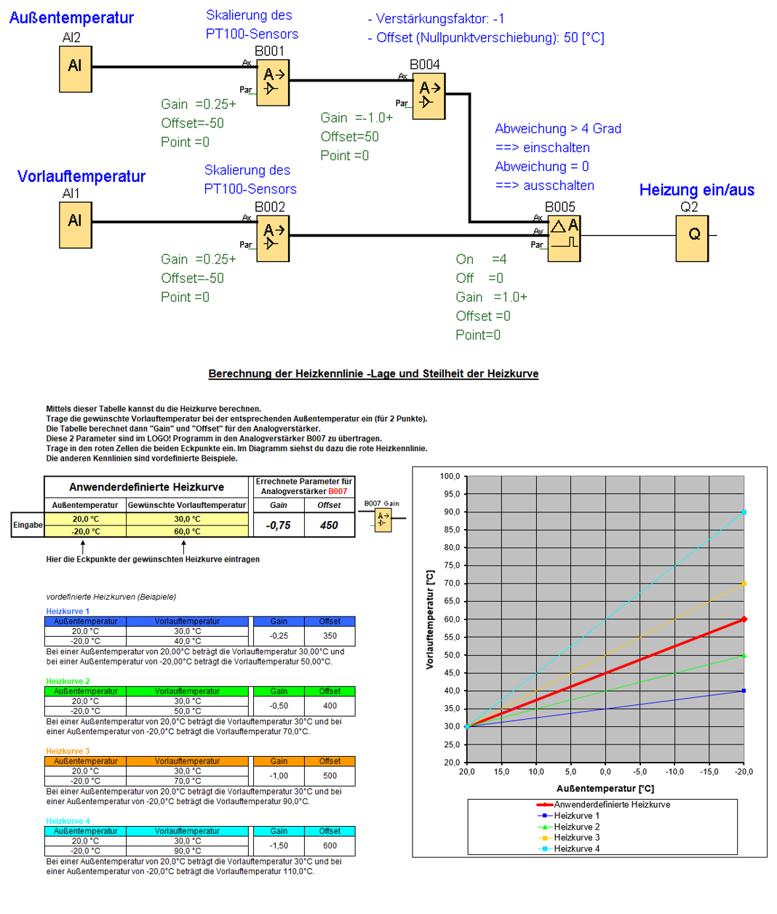

Es soll eine Heizungssteuerung in Abhängigkeit der Außentemperatur und der Vorlauftemperatur realisiert werden. Als Temperatursensoren kommen zwei PT100 zum Einsatz. 
Die Sensorspannung wird über Analogverstärker angepasst und die Heizkurve über die Parameter Gain und Offset eingestellt. Zur Ermittlung der 
Parametereinstellung nutzen wir eine EXCEL-Tabelle. 

  
