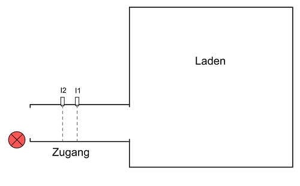
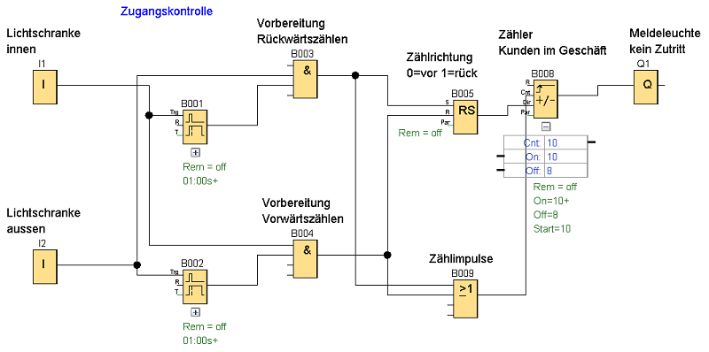

Ein Geschäft möchte die Anzahl seiner Kunden im Laden wissen. Am Eingang sind zwei Lichtschranken angebracht, die bei ein- und austretenden Kunden ein Signal abgeben. 
Die Steuerung soll zwischen eintretenden und austretenden Kunden unterscheiden und diese zählen. Sind 10 Kunden im Laden soll eine Warnleuchte einschalten und den Eintritt 
weiterer Kunden verbieten. Haben 3 Kunden den Laden verlassen erlischt, die Warnleuchte und es dürfen wieder Kunden eintreten.

+ I1 Lichtschranke (zur Simulation wird eine Taster-Funktion als Schließer eingestellt)
+ I2 Lichtschranke (zur Simulation wird eine Taster-Funktion als Schließer eingestellt)
+ Q1 Meldeleuchte 

+ Richtungserkennung: I1 > I2 Kunden verlassen das Geschäft
+ Richtungserkennung: I2 > I1 Kunden betreten das Geschäft

Technologieschema:
 

  

  
