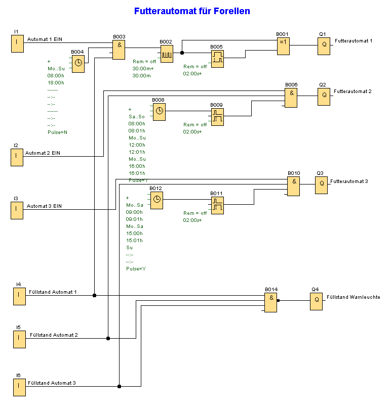

Futterautomat für Forellen

In einer Teichanlage sollen Fütterungsautomaten mit LOGO! gesteuert werden. Die Fütterung der Forellen erfolgt in Abhängigkeit ihrer Größe und ihres Alters zu unterschiedlichen Zeiten. Wenn die Futterbehälter leer sind, soll der Automat abgeschaltet werden, damit die Batterie nicht unnötig belastet wird.
Mit LOGO! werden 3 Futterautomaten angesteuert. Ein Automat besteht aus einem konischen Behälter mit einem 12V-Motor für die Streuscheibe. Durch die konische Behälterform und die Vibration des Motors ist sichergestellt, dass immer Futter nachgeführt wird. Futterautomat 1 an Ausgang Q1 versorgt die Brut. Jeden Tag in der Zeit von 8:00 bis 18:00 Uhr soll stündlich Futter ausgegeben werden. Mit Hilfe der integrierten Zeitschaltuhr und des Taktgebers (eingestellte Zeit = 30 Minuten) kann einfach ein Impuls zu jeder Stunde erzeugt werden. Über die Einschaltverzögerung wird die Futterausgabe für nur 2 Sekunden freigegeben. Die Futterausgabe erfolgt allerdings nur, wenn der Einschalter an I1 betätigt ist und der Füllstandsmelder an I4 „voll“ meldet. Für die Setzlinge und Speiseforellen ist eine geringere Schalthäufigkeit ausreichend. So wird der zweite Automat an Q2 für die Setzlinge täglich um 12:00 und um 16:00 Uhr und am Wochenende um 8:00 Uhr für 2 Sekunden angesteuert. 
Für die Speiseforellen erfolgt die Futterausgabe über Automat 3 an Q3 von Montag bis Samstag um 9:00 und um 15:00 Uhr. Automat 2 und 3 geben ebenfalls nur Futter aus, wenn der Einschalter an I2 bzw. I3 betätigt ist und der Füllstandsmelder an I5 bzw. I6 „voll“ meldet.
Ist einer der Automaten leer, so wird dies über die Füllstandsmelder an I4, I5 bzw. I6 gemeldet und eine Signallampe an Q4 leuchtet auf.

Verwendete Komponenten:

+ LOGO! 12RC
+ I1 Einschalter Automat 1 (Schließer)
+ I2 Einschalter Automat 2 (Schließer)
+ I3 Einschalter Automat 3 (Schließer)
+ I4 Füllstandsmelder Automat 1 (Öffner)
+ I5 Füllstandsmelder Automat 2 (Öffner)
+ I6 Füllstandsmelder Automat 3 (Öffner)
+ 1 Futterautomat 1
+ Q2 Futterautomat 2
+ Q3 Futterautomat 3
+ Q4 Signalleuchte

 

  

