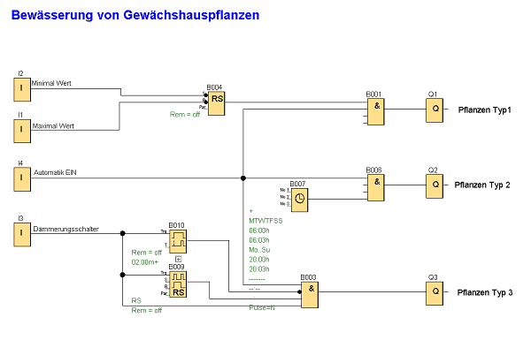

Bewässerung von Gewächshauspflanzen

In einem Gewächshaus soll die Bewässerung der Pflanzen gesteuert werden. Dabei wird zwischen drei Pflanzentypen unterschieden.
Bei Typ 1 handelt es sich um Wasserpflanzen in einem Becken, dessen Wasserpegel in einem bestimmten Bereich gehalten werden soll. Die
Pflanzen des zweiten Typs sollen morgens und abends jeweils 3 Minuten bewässert werden und die Pflanzen des dritten Typs jeden zweiten Abend 2 Minuten.
Die automatische Bewässerung kann natürlich auch ausgeschaltet werden.

Bewässerung Planzen-Typ 1:
Über die Schwimmschalter für Maximal- und Minimalwert (an I1 und I2) wird der Wasserpegel des Beckens immer in diesem vorgegebenen Bereich gehalten.
Bewässerung Pflanzen-Typ 2:
Über die Zeitschaltuhr wird morgens von 6:00 bis 6:03 Uhr und abends von 20:00 bis 20:03 Uhr die Bewässerung jeweils für 3 Minuten eingeschaltet (täglich).
Bewässerung Pflanzen-Typ 3:
Mit Hilfe der Stromstoßfunktion werden die Pflanzen nur jeden zweiten Tag bewässert; immer abends für 2 Minuten, wenn der Dämmerungsschalter an I3 anspricht. 

Besonderheiten:
Die Bewässerungszeit kann morgens und abends beliebig geändert werden. Neben der Bewässerung der Pflanzen können mit LOGO! auch die Beleuchtung oder die Belüftung des Gewächshauses gesteuert werden.

Verwendete Komponenten:

+ I1 Schwimmschalter für Maximalwert (Öffner)
+ I2 Schwimmschalter für Minimalwert (Schließer)
+ 3 Dämmerungsschalter (Schließer)
+ I4 Schalter für automatisch gesteuerte Bewässerung (Schließer)
+ Q1 Magnetventil für Bewässerung Pflanzen-Typ 1
+ Q2 Magnetventil für Bewässerung Pflanzen-Typ 2
+ Q3 Magnetventil für Bewässerung Pflanzen-Typ 3

