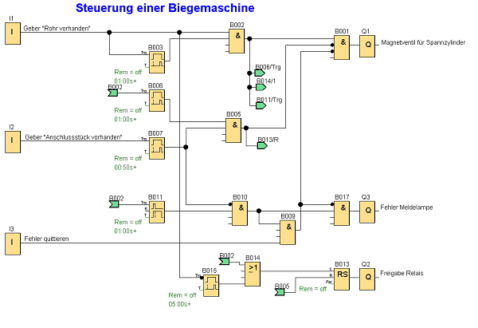

Steuerung einer Biegemaschine

Der Biegevorgang von Auspuff-Rohren soll gesteuert werden. Der Biegevorgang wird erst dann angestoßen, wenn sowohl Rohr als auch Anschlussstück vorhanden sind. 
Ist ein Teil defekt oder nicht vorhanden, wird dies über eine Meldeleuchte gemeldet.
Über den Näherungsschalter an I1 wird erfasst, ob ein Rohr vorhanden ist (hierzu ist eine Anzugsverzögerung von 1 Sekunde eingestellt). Danach wird das Rohr über das 
Magnetventil an Q1 eingespannt. Wenn auch das Anschlussstück vorhanden ist (Geber an I2), wird das Rohr losgelassen und die Freigabe für das Biegen durch Rücksetzten 
des Freigaberelais an Q2 erteilt (Q2 = 0). Ein Freigabevorgang dauert max. 5 Sekunden. Dies ist die Grenzzeit für die Freigabe. Wird innerhalb dieser 5 Sekunden kein Rohr erfasst, 
wird die Freigabe für den Biegevorgang durch Setzen des Freigaberelais (Q2 = 1) zurückgenommen. Wird ein Teil als defekt oder unvollständig erkannt, so wird dies über 
die Meldeleuchte an Q3 gemeldet. Über I3 kann der Fehler quittiert und das defekte Teil entfernt werden. Dabei wird das Rohr losgelassen und der Vorgang kann von Neuem beginnen.

Verwendete Komponenten:

+ I1 Geber „Rohr vorhanden“ (Schließer)
+ I2 Geber „Anschlussstück vorhanden“ (Schließer)
+ I3 Quittier-Taste für Fehler (Schließer)
+ Q1 Magnetventil für Spannzylinder
+ Q2 Freigaberelais
+ Q3 Fehlermeldelampe

