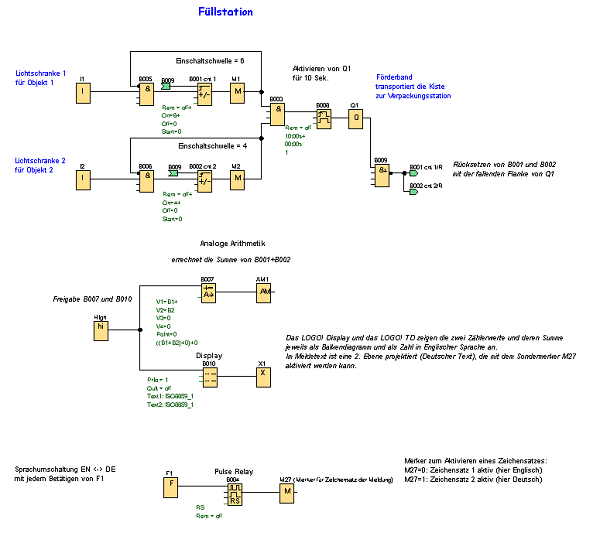

Füllstation

Ein Behälter soll mit zwei verschiedenen Objekten bis zu einer angegebenen Gesamtzahl jedes Objekts gefüllt werden. 
Wenn alle Objekte im Behälter sind, wird er in die Verpackungsstation transportiert. Ein Förderband transportiert beide Arten von Objekten zum Behälter. (In diesem Beispiel wird das Füllförderband nicht gezeigt.) 
Das Schaltprogramm für dieses Beispiel nutzt zwei Vorwärts-/Rückwärtszähler zum Zählen der Objekte jeder Art, eine Anweisung der analogen Arithmetik zum Summieren der Gesamtzahl der Objekte und Meldetexte, die auf dem LOGO! Display und LOGO! TD (Textdisplay) die Anzahl für jede Objektart sowie die bisherige Gesamtzahl der gezählten Objekte anzeigt.
Dieser Prozess wird im Folgenden beschrieben:
Zum Füllen des Behälters wird jedes Objekt mittels Förderband zum Behälter transportiert (dieser Vorgang ist nicht Teil dieses Beispiels).
Die Reihenfolge, in der die Objekte in den Behälter fallen, ist zufällig.
Jedes Objekt, das in den Behälter fällt, wird von einem Sensor gezählt.
Das angeschlossene LOGO! TD sowie das LOGO! Display müssen anzeigen, wie viele Objekte jeder Art gezählt wurden und wie viele Objekte sich insgesamt in dem Behälter befinden.
Schaltprogramm in LOGO!Soft Comfort
An die beiden digitalen Eingänge I1 und I2 sind Lichtschranken angeschlossen; Sensoren, die erkennen, wann ein Objekt in den Behälter fällt. 
Die beiden Zähler (B001 und B002) zählen jedes Objekt für die beiden spezifischen Arten von Objekten, wenn diese in den Behälter fallen. 
Die Einschaltschwelle jedes Zählers gibt die maximal mögliche Anzahl für jede Art von Objekt an. Wenn der Behälter voll ist, wird ein Förderband zehn Sekunden lang aktiviert, 
um den gefüllten Behälter zur Verpackungsstation und einen leeren Behälter zur Füllstation zu transportieren.
Das Schaltprogramm nutzt einen Meldetextfunktionsblock, um die Gesamtzahl und die Anzahl jeder Art auf dem LOGO! TD und auf dem LOGO! Display anzuzeigen. 
Der Meldetext nutzt die Tickerfunktion, um abwechselnd Balkendiagramme der gezählten Objekte und eine Textzusammenfassung der Zählwerte anzuzeigen. 
Außerdem wird der Text der Meldung je nach aktuell eingestelltem Zeichensatz für Meldetexte in Englisch oder Deutsch angezeigt.

