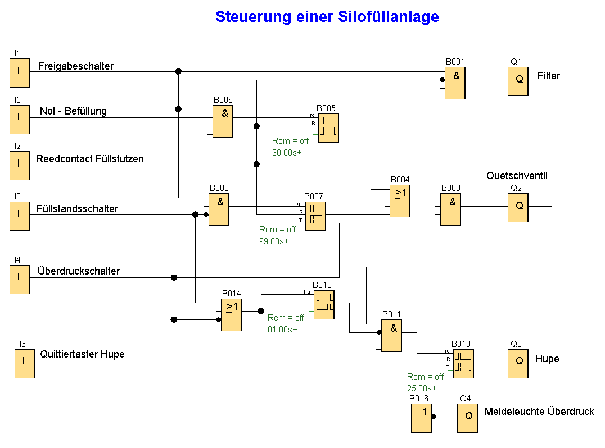

Steuerung einer Silofüllanlage

Die LOGO! wird zur Steuerung und Überwachung von Silofüllanlagen eingesetzt. Die Silos werden über einen Füllschlauch vom LKW aus mit Kalk oder Zement gefüllt.
Der Füllvorgang kann nur dann eingeleitet werden, wenn der Freigabeschalter an I1 eingeschaltet und der Füllschlauch ordnungsgemäß angeschlossen ist. Ein Reedkontakt am Füllstutzen signalisiert, ob der Füllschlauch richtig mit dem Silo verbunden ist. Dieses Signal wird über den Eingang I2 in LOGO! eingelesen. Daraufhin wird das Quetschventil an Q2 geöffnet. Gleichzeitig wird der Abblasfilter an Q1 angesteuert. Dieser muss während des gesamten Füllvorgangs eingeschaltet sein. Kalk oder Zement kann jetzt in den Silo gepumpt Ist der Silo voll, so wird dies über den Füllstandsschalter an I3 gemeldet. Eine Hupe signalisiert dem Befüller, dass noch 99 Sekunden verbleiben bis der Vorgang automatisch beendet wird. Innerhalb dieser Zeit muss das Ventil am LKW geschlossen werden, damit der Füllschlauch noch entleert wird. Die Hupe kann über den Quittiertaster an I6 vorzeitig zurückgesetzt werden. Oder sie wird automatisch nach 25 Sekunden ausgeschaltet.
Falls man es nicht rechtzeitig geschafft hat, den Schlauch zu entleeren, kann über den Taster an I5 eine Not-Befüllung von 30 Sekunden vorgenommen werden. Eine Überdrucküberwachung im Silo schaltet ebenfalls den Füllvorgang automatisch ab. Dies wird über die Meldelampe an Q4 angezeigt.

Verwendete Komponenten:

+ LOGO! 230RC
+ I1 Freigabeschalter (Schließer)
+ I2 Reedkontakt Füllstutzen (Schließer)
+ 3 Füllstandsschalter (Schließer)
+ I4 Überdruckschalter (Öffner)
+ I5 Taster Not-Befüllung (Schließer)
+ I6 Quittiertaster Hupe (Schließer)
+ Q1 Filter
+ Q2 Quetschventil
+ Q3 Hupe
+ Q4 Meldeleuchte Überdruck

