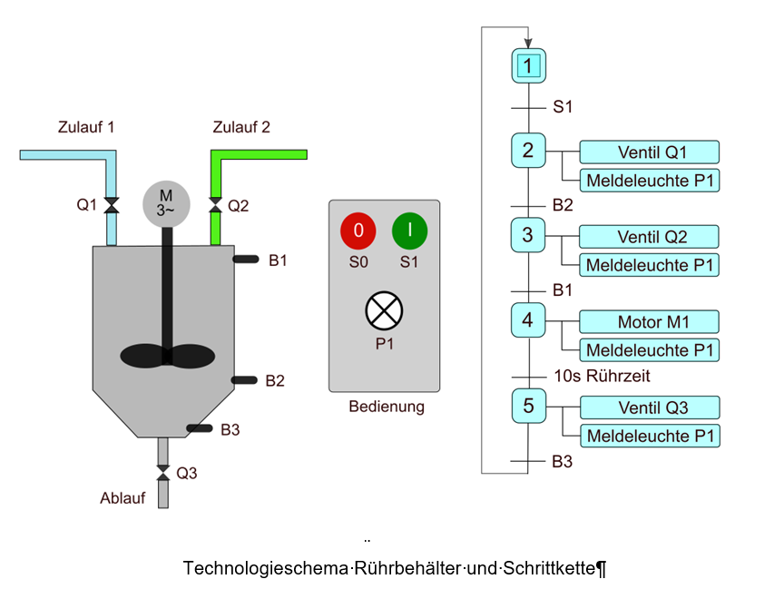
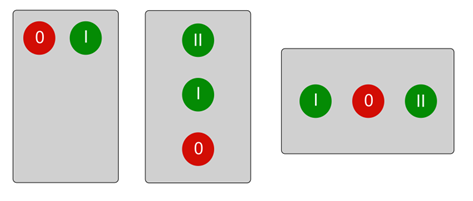
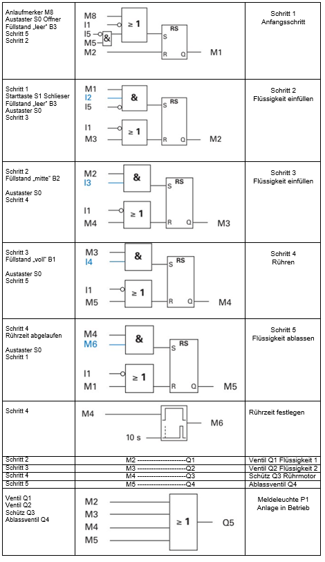
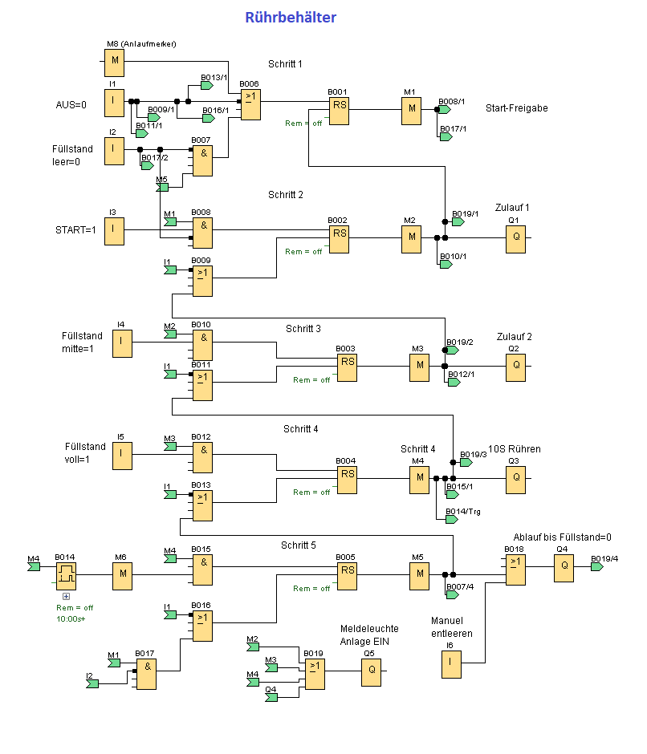

Ablaufsteuerung Rührbehälter

In einem Behälter wird erst Flüssigkeit 1, dann Flüssigkeit 2 eingefüllt. Anschließend werden die Flüssigkeiten verrührt und nach der Verrührzeit aus dem Behälter abgepumpt. B1, B2 und B3 geben eine 1 aus, wenn sie mit Flüssigkeit bedeckt sind.

Für die Anordnung und Farben der Start, Stopp-Taster siehe VDE0113

Ablaufsteuerung eines Rührbehälters

Im Schritt 1 muss beim Einschalten der Anlaufmerker M8 aktiv sein. M8 ist im ersten Zyklus 1, danach wird er von der LOGO! automatisch rückgesetzt. Alle anderen Merker haben bei Einschalten den Zustand „0“. Bei dieser Steuerung gelangt man auch in den Schritt 1, wenn die Schrittkette durchlaufen ist oder der AUS-Taster gedrückt wurde.
Die Programmierung der einzelnen Schritte erfolgt immer nach dem gleichen Schema. Ein Schritt wird gesetzt, wenn der vorherige aktiv ist und die Schrittbedingungen erfüllt sind. Der vorherige Schritt wird dann zurückgesetzt. Der aktive Schritt wird auch verlassen, wenn z.B. die Ausschaltbedingung erfüllt ist.

