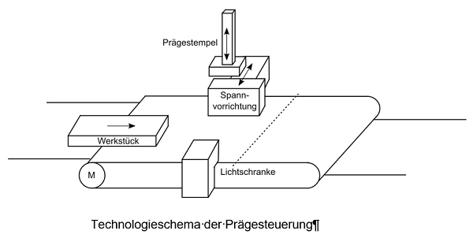
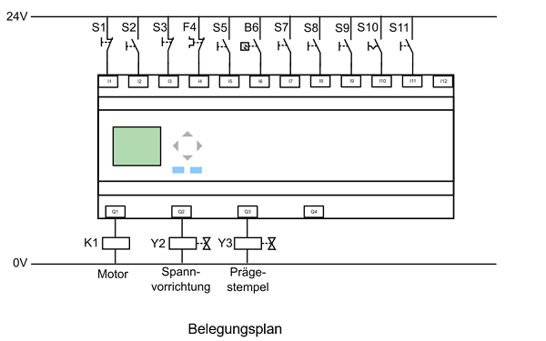
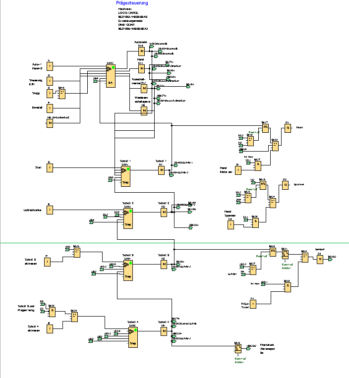

Ablaufsteuerung Prägesteuerung

Das Bild zeigt das Technologieschema einer Prägesteuerung. Die Steuerung besitzt einen Hand- als auch einen Automatikbetrieb. Die Spannvorrichtung und der Prägestempel werden elektrohydraulisch betrieben, 
die Zylinder sind federrückstellend (ohne Spannung befinden sich die Zylinder eingefahren in Ruhelage). Der Austaster oder das Bimetallrelais schalten die Ausgänge sofort ab. 

Der Belegungsplan

Automatikbetrieb S1 = 1

+ Mit Betätigung des Ein-Tasters „Steuerung EIN“ schaltet die Steuerung ein
+ Mit Betätigung des START-Tasters läuft das Förderband an, erreicht das Werkstück die Lichtschranke B6 stoppt das Förderband und das Werkstück wird gespannt.
+ Gleichzeitig fährt der Prägestempel nach unten. Der Prägevorgang dauert 5s.
+ Ist der Prägevorgang abgeschlossen, schaltet der Motor für 3s sein, das Förderband läuft und das Werkstück wird abtransportiert.
+ Mit Betätigung der Start-Taste kann der Vorgang wiederholt werden.

Handbetrieb S5 = 0

+ Der Handbetrieb dient zum Einrichten der Maschine
+ Der Schalter S1 = 0 aktiviert die Betriebsart HAND. Nach Betätigung der Steuerung-Ein Taste S2 können die Aktoren manuell gesteuert werden.
+ S9 betätigt den Motor im Tipp-Betrieb
+ Mit dem Schalter S10 kann das Werkstück gespannt werden
+ S11 betätigt den Prägestempel im Tipp-Betrieb
+ Die Betriebsart Hand wird mit der Stopp-Taste S3 deaktiviert.

Betriebsarten

Nach DIN VDE 0113 darf die Wahl der Betriebsart allein den Maschinenbetrieb nicht auslösen, dazu ist eine getrennte Handlung erforderlich. Die Betriebsart Automatik ist dann aktiv, wenn der Wahlschalter auf Automatik steht und der Ein-Taster betätigt wird. Die Betriebsart wird erst über den Aus-Taster abgeschaltet. Für den Handbetrieb gilt entsprechendes. Das bedeutet, dass das Umschalten des Wahlschalters während einer Betriebsart in die andere, noch keine Aktion auslöst.

