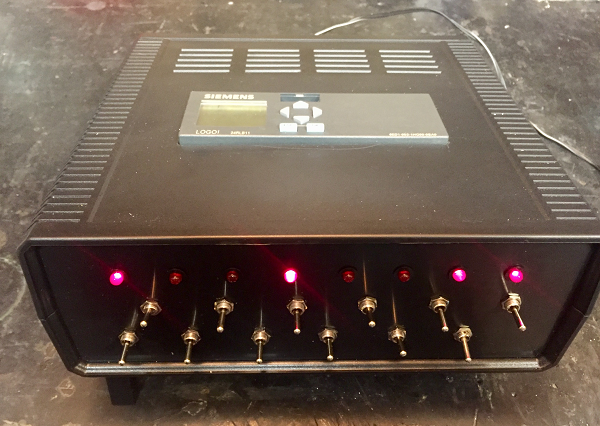

|[:skull:ISSUE](https://github.com/frankyhub/LOGO_Steuerungstechnik/issues?q=is%3Aissue)|[:speech_balloon: Forum /Discussion](https://github.com/frankyhub/Markdown/discussions?discussions_q=)|[:grey_question:WiKi](https://github.com/frankyhub/LOGO_Steuerungstechnik/wiki/Sicherheitsbestimmungen)|
|--|--|--|
| | | |
|||

## LOGO! Kleinsteuerungen 

Als LOGO! Kleinsteuerungen bezeichnet man eine Familie von intelligenten Logikmodulen des Herstellers Siemens. Diese werden zur Automatisierung von Steuerungstechnik eingesetzt. 
Das System bietet sich vor allem für kleinere Steuerungsaufgaben an und ist vielseitig einsetzbar.

Die gewünschte Anwendung wird mit Hilfe der LOGO! Soft Comfort Software programmiert. Als Programmierschnittelle und zur Datenübertragung dient entweder ein USB-Interface 
oder eine Ethernet-Schnittstelle. Über Erweiterungsmodule aus der LOGO! Familie können auch in die bestehende Installation Komponenten nachgerüstet werden, 
um die Anwendung bei Bedarf zu erweitern. 

Zur Produktfamilie der LOGO! Kleinsteuerungen gehören alle, für den Aufbau eines Steuerungssystems notwendigen Komponenten:

+ Logikmodule mit oder ohne Displays
+ Digitale oder analoge Erweiterungsmodule
+ Externes Textdisplay
+ Kommunikationsmodule
+ Schaltelemente
+ Elemente zur Spannungsversorgung
+ Programmiersoftware
+ Die einzelnen Komponenten können individuell kombiniert und verschaltet werden.

  LOGO! Box für den Test der Programme:

  
